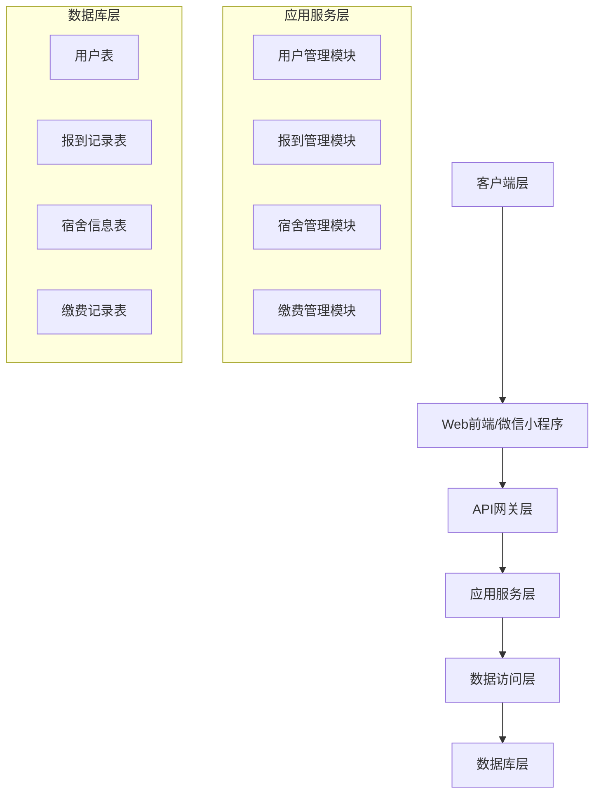
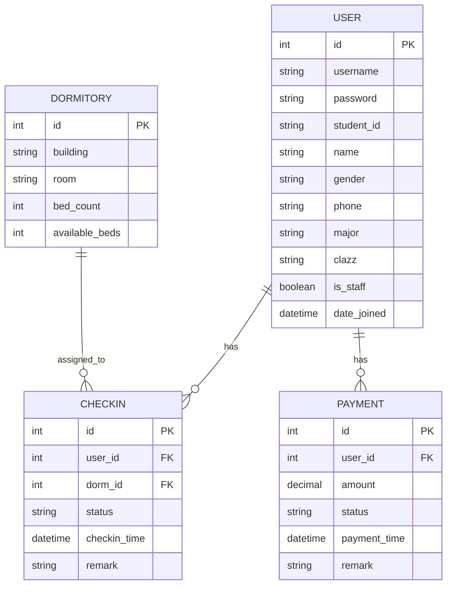

# 大学新生报到智能助手系统
## 项目技术方案（主体MVP版）v2.0

| 文档版本 | v2.0 | 编写日期 | 2026-04-27 |
|---------|------|---------|------------|
| 编写人 | 张骜元 | 项目状态 | 开发完成 |
| 审核人 | - | 生效日期 | 2026-04-27 |

---

## 目录
- [大学新生报到智能助手系统](#大学新生报到智能助手系统)
  - [项目技术方案（主体MVP版）v2.0](#项目技术方案主体mvp版v20)
  - [目录](#目录)
  - [1. 项目概述](#1-项目概述)
    - [1.1 项目背景](#11-项目背景)
    - [1.2 项目目标](#12-项目目标)
    - [1.3 MVP版本范围](#13-mvp版本范围)
  - [2. 技术选型](#2-技术选型)
    - [2.1 整体技术栈](#21-整体技术栈)
    - [2.2 选型理由](#22-选型理由)
  - [3. 系统架构设计](#3-系统架构设计)
    - [3.1 整体架构图](#31-整体架构图)
    - [3.2 分层架构说明](#32-分层架构说明)
    - [3.3 模块划分](#33-模块划分)
  - [4. 核心功能模块设计](#4-核心功能模块设计)
    - [4.1 用户管理模块](#41-用户管理模块)
    - [4.2 新生报到模块](#42-新生报到模块)
    - [4.3 宿舍管理模块](#43-宿舍管理模块)
    - [4.4 缴费管理模块](#44-缴费管理模块)
  - [5. 数据库设计](#5-数据库设计)
    - [5.1 数据库E-R图](#51-数据库e-r图)
    - [5.2 核心数据表结构](#52-核心数据表结构)
      - [用户表（users\_user）](#用户表users_user)
      - [宿舍信息表（dormitory\_dormitory）](#宿舍信息表dormitory_dormitory)
      - [报到记录表（checkin\_checkin）](#报到记录表checkin_checkin)
      - [缴费记录表（payment\_payment）](#缴费记录表payment_payment)
  - [6. API接口设计](#6-api接口设计)
    - [6.1 RESTful接口规范](#61-restful接口规范)
    - [6.2 统一返回格式](#62-统一返回格式)
    - [6.3 核心接口列表](#63-核心接口列表)
  - [7. 开发环境与配置](#7-开发环境与配置)
    - [7.1 环境要求](#71-环境要求)
    - [7.2 本地开发环境搭建](#72-本地开发环境搭建)
  - [8. 部署方案](#8-部署方案)
    - [8.1 本地开发部署](#81-本地开发部署)
    - [8.2 生产环境部署](#82-生产环境部署)
      - [服务器环境准备](#服务器环境准备)
      - [部署步骤](#部署步骤)
  - [9. 风险评估与应对](#9-风险评估与应对)
  - [10. 附录](#10-附录)
    - [10.1 参考资料](#101-参考资料)
    - [10.2 版本更新记录](#102-版本更新记录)

---

## 1. 项目概述

### 1.1 项目背景
传统高校新生报到流程存在诸多痛点：新生需要在多个地点排队办理手续、信息分散在不同部门、管理员难以实时统计报到进度、人工处理效率低下且容易出错。本项目旨在通过数字化手段，实现新生报到全流程的线上化、智能化管理，提升报到效率和用户体验。

### 1.2 项目目标
- 为新生提供一站式线上报到服务，减少线下排队时间
- 为管理员提供统一的后台管理平台，实现数据集中管理
- 实时统计报到进度、宿舍分配情况和缴费状态
- 支持对接Web前端和微信小程序，提供多端访问能力
- 构建可扩展的系统架构，为后续功能迭代提供基础

### 1.3 MVP版本范围
**已实现功能**：
- 系统管理员账号管理
- 新生用户信息管理
- 新生报到状态管理
- 宿舍信息管理与分配
- 缴费记录管理
- 完整的管理员后台
- 全套RESTful API接口

**暂不实现功能**（后续迭代）：
- 新生自主注册与登录
- 线上缴费功能
- 自动宿舍分配算法
- 报到流程可视化
- 消息通知功能
- 数据统计与报表

---

## 2. 技术选型

### 2.1 整体技术栈

| 类别 | 技术选型 | 版本号 |
|-----|---------|-------|
| 编程语言 | Python | 3.9+ |
| Web框架 | Django | 4.2.30 |
| API框架 | Django REST Framework | 3.16.1 |
| 跨域处理 | django-cors-headers | 4.9.0 |
| 数据库（开发） | SQLite3 | 内置 |
| 数据库（生产） | MySQL | 8.0+ |
| ORM框架 | Django ORM | 4.2.30 |
| 认证系统 | Django内置认证 | 4.2.30 |
| 开发工具 | Visual Studio Code | 最新版 |
| 虚拟环境 | Python venv | 内置 |
| 版本控制 | Git | 最新版 |
| 生产部署 | Nginx + Gunicorn | 最新版 |
| 操作系统 | Windows/Linux/macOS | 支持 |

### 2.2 选型理由
1. **Django**：成熟稳定的全栈Web框架，内置ORM、认证系统、管理后台等功能，开发效率高，适合快速构建企业级应用
2. **Django REST Framework**：Django生态中最流行的API框架，提供完整的序列化、认证、权限控制等功能，支持自动生成API文档
3. **SQLite3**：Django内置数据库，无需额外配置，适合开发和测试环境
4. **前后端分离架构**：后端只提供API接口，前端负责页面展示，提高系统的可维护性和可扩展性
5. **Python生态**：拥有丰富的第三方库和工具，社区活跃，问题解决资源丰富

---

## 3. 系统架构设计

### 3.1 整体架构图


### 3.2 分层架构说明
1. **客户端层**：负责与用户交互，包括Web前端和微信小程序
2. **API网关层**：统一处理请求路由、跨域、认证等公共逻辑
3. **应用服务层**：实现核心业务逻辑，分为多个功能模块
4. **数据访问层**：通过ORM框架与数据库交互，封装数据操作
5. **数据库层**：存储系统所有业务数据

### 3.3 模块划分
- **api模块**：提供所有RESTful API接口
- **users模块**：用户信息管理
- **checkin模块**：新生报到流程管理
- **dormitory模块**：宿舍信息与分配管理
- **payment模块**：缴费记录管理
- **freshman_assistant模块**：项目主配置模块

---

## 4. 核心功能模块设计

### 4.1 用户管理模块
- **用户角色**：系统管理员、在校新生
- **核心功能**：
  - 用户信息的增删改查
  - 用户角色管理
  - 密码重置
  - 管理员后台可视化管理
- **扩展字段**：学号、姓名、性别、手机号、专业、班级

### 4.2 新生报到模块
- **报到状态**：待报到、已完成、已驳回
- **核心功能**：
  - 报到记录的增删改查
  - 报到状态更新
  - 报到时间自动记录
  - 管理员备注功能
  - 按报到状态筛选查询

### 4.3 宿舍管理模块
- **核心功能**：
  - 宿舍信息的增删改查
  - 剩余床位自动统计
  - 手动分配宿舍
  - 宿舍与新生关联
  - 防止重复宿舍信息

### 4.4 缴费管理模块
- **缴费状态**：未缴费、已缴费
- **核心功能**：
  - 缴费记录的增删改查
  - 缴费状态更新
  - 缴费金额和时间记录
  - 按缴费状态筛选查询

---

## 5. 数据库设计

### 5.1 数据库E-R图


### 5.2 核心数据表结构

#### 用户表（users_user）
| 字段名 | 数据类型 | 约束 | 说明 |
|-------|---------|------|------|
| id | int | PRIMARY KEY, AUTO_INCREMENT | 主键ID |
| username | varchar(150) | UNIQUE, NOT NULL | 用户名 |
| password | varchar(128) | NOT NULL | 密码（加密存储） |
| student_id | varchar(20) | UNIQUE | 学号 |
| name | varchar(50) | | 姓名 |
| gender | varchar(10) | | 性别 |
| phone | varchar(20) | | 手机号 |
| major | varchar(100) | | 专业 |
| clazz | varchar(50) | | 班级 |
| is_staff | boolean | DEFAULT FALSE | 是否为管理员 |
| date_joined | datetime | NOT NULL | 注册时间 |

#### 宿舍信息表（dormitory_dormitory）
| 字段名 | 数据类型 | 约束 | 说明 |
|-------|---------|------|------|
| id | int | PRIMARY KEY, AUTO_INCREMENT | 主键ID |
| building | varchar(20) | NOT NULL | 楼栋号 |
| room | varchar(20) | NOT NULL | 房间号 |
| bed_count | int | NOT NULL | 总床位数 |
| available_beds | int | NOT NULL | 剩余床位数 |

#### 报到记录表（checkin_checkin）
| 字段名 | 数据类型 | 约束 | 说明 |
|-------|---------|------|------|
| id | int | PRIMARY KEY, AUTO_INCREMENT | 主键ID |
| user_id | int | FOREIGN KEY, UNIQUE | 用户ID |
| dorm_id | int | FOREIGN KEY | 宿舍ID |
| status | varchar(20) | DEFAULT 'pending' | 报到状态 |
| checkin_time | datetime | | 报到时间 |
| remark | text | | 备注 |

#### 缴费记录表（payment_payment）
| 字段名 | 数据类型 | 约束 | 说明 |
|-------|---------|------|------|
| id | int | PRIMARY KEY, AUTO_INCREMENT | 主键ID |
| user_id | int | FOREIGN KEY | 用户ID |
| amount | decimal(10,2) | NOT NULL | 缴费金额 |
| status | varchar(20) | DEFAULT 'unpaid' | 缴费状态 |
| payment_time | datetime | | 缴费时间 |
| remark | text | | 备注 |

---

## 6. API接口设计

### 6.1 RESTful接口规范
- 所有接口使用HTTP标准方法：GET（查询）、POST（创建）、PUT（更新）、DELETE（删除）
- 接口路径使用名词复数形式
- 基础URL：`http://domain.com/api/`
- 数据格式：JSON
- 编码格式：UTF-8
- 状态码：使用标准HTTP状态码

### 6.2 统一返回格式
```json
{
    "code": 200,
    "message": "success",
    "data": {}
}
```
- `code`：状态码，200表示成功，其他表示失败
- `message`：返回信息
- `data`：返回数据

### 6.3 核心接口列表

| 接口路径 | 请求方法 | 说明 |
|---------|---------|------|
| `/api/user/` | GET | 获取所有用户列表 |
| `/api/user/` | POST | 创建新用户 |
| `/api/user/{id}/` | GET | 获取指定用户详情 |
| `/api/user/{id}/` | PUT | 更新指定用户信息 |
| `/api/user/{id}/` | DELETE | 删除指定用户 |
| `/api/dorm/` | GET | 获取所有宿舍列表 |
| `/api/dorm/` | POST | 创建新宿舍 |
| `/api/dorm/{id}/` | GET | 获取指定宿舍详情 |
| `/api/dorm/{id}/` | PUT | 更新指定宿舍信息 |
| `/api/dorm/{id}/` | DELETE | 删除指定宿舍 |
| `/api/checkin/` | GET | 获取所有报到记录 |
| `/api/checkin/` | POST | 创建新报到记录 |
| `/api/checkin/{id}/` | GET | 获取指定报到记录详情 |
| `/api/checkin/{id}/` | PUT | 更新指定报到记录 |
| `/api/checkin/{id}/` | DELETE | 删除指定报到记录 |
| `/api/payment/` | GET | 获取所有缴费记录 |
| `/api/payment/` | POST | 创建新缴费记录 |
| `/api/payment/{id}/` | GET | 获取指定缴费记录详情 |
| `/api/payment/{id}/` | PUT | 更新指定缴费记录 |
| `/api/payment/{id}/` | DELETE | 删除指定缴费记录 |

---

## 7. 开发环境与配置

### 7.1 环境要求
- Python 3.9 或更高版本
- pip 20.0 或更高版本
- 操作系统：Windows 10/11、Ubuntu 20.04+、macOS 11+
- 内存：至少4GB
- 硬盘：至少10GB可用空间

### 7.2 本地开发环境搭建
1. **克隆项目代码**
```bash
git clone https://github.com/your-username/freshman-assistant.git
cd freshman-assistant
```

2. **创建并激活虚拟环境**
```bash
# Windows系统
python -m venv venv
venv\Scripts\activate.bat

# Linux/macOS系统
python3 -m venv venv
source venv/bin/activate
```

3. **安装项目依赖**
```bash
pip install -r requirements.txt -i https://pypi.tuna.tsinghua.edu.cn/simple
```

4. **数据库迁移**
```bash
python manage.py makemigrations
python manage.py migrate
```

5. **创建超级管理员**
```bash
python manage.py createsuperuser
```

6. **启动开发服务器**
```bash
python manage.py runserver 0.0.0.0:8000
```

7. **访问系统**
- 管理员后台：http://127.0.0.1:8000/admin/
- API接口文档：http://127.0.0.1:8000/api/

---

## 8. 部署方案

### 8.1 本地开发部署
详见7.2节本地开发环境搭建步骤。

### 8.2 生产环境部署
#### 服务器环境准备
- 操作系统：Ubuntu 20.04 LTS
- 配置：2核4GB及以上
- 带宽：1Mbps及以上

#### 部署步骤
1. **服务器环境配置**
```bash
sudo apt update && sudo apt upgrade -y
sudo apt install python3 python3-pip python3-venv nginx mysql-server -y
```

2. **项目上传与配置**
```bash
sudo mkdir -p /var/www/freshman-assistant
sudo chown -R $USER:$USER /var/www/freshman-assistant
# 上传项目代码到服务器
cd /var/www/freshman-assistant
python3 -m venv venv
source venv/bin/activate
pip install -r requirements.txt
pip install gunicorn
```

3. **生产环境配置修改**
编辑 `freshman_assistant/settings.py` 文件：
```python
DEBUG = False
ALLOWED_HOSTS = ['your-domain.com', '服务器IP地址']

DATABASES = {
    'default': {
        'ENGINE': 'django.db.backends.mysql',
        'NAME': 'freshman_db',
        'USER': 'db_user',
        'PASSWORD': 'db_password',
        'HOST': '127.0.0.1',
        'PORT': '3306',
        'OPTIONS': {
            'charset': 'utf8mb4'
        }
    }
}

STATIC_ROOT = '/var/www/freshman-assistant/static/'
```

4. **收集静态文件**
```bash
python manage.py collectstatic
```

5. **配置Gunicorn**
创建 `/etc/systemd/system/freshman.service` 文件：
```ini
[Unit]
Description=Freshman Assistant Gunicorn daemon
After=network.target

[Service]
User=www-data
Group=www-data
WorkingDirectory=/var/www/freshman-assistant
ExecStart=/var/www/freshman-assistant/venv/bin/gunicorn \
          --access-logfile - \
          --workers 3 \
          --bind unix:/var/www/freshman-assistant/freshman.sock \
          freshman_assistant.wsgi:application

[Install]
WantedBy=multi-user.target
```

启动并设置开机自启：
```bash
sudo systemctl start freshman
sudo systemctl enable freshman
```

6. **配置Nginx**
创建 `/etc/nginx/sites-available/freshman` 文件：
```nginx
server {
    listen 80;
    server_name your-domain.com 服务器IP地址;

    location /static/ {
        alias /var/www/freshman-assistant/static/;
    }

    location / {
        proxy_pass http://unix:/var/www/freshman-assistant/freshman.sock;
        proxy_set_header Host $host;
        proxy_set_header X-Real-IP $remote_addr;
    }
}
```

启用配置并重启Nginx：
```bash
sudo ln -s /etc/nginx/sites-available/freshman /etc/nginx/sites-enabled/
sudo nginx -t
sudo systemctl restart nginx
```

---


## 9. 风险评估与应对

| 风险点 | 风险等级 | 应对措施 |
|-------|---------|---------|
| 依赖库版本冲突 | 低 | 使用虚拟环境隔离依赖，固定依赖版本号 |
| 数据库性能问题 | 中 | 合理设计索引，优化查询语句，生产环境使用MySQL |
| 安全漏洞 | 中 | 关闭DEBUG模式，配置ALLOWED_HOSTS，定期更新依赖库 |
| 部署问题 | 中 | 编写详细的部署文档，使用自动化部署工具 |
| 需求变更 | 高 | 采用MVP开发模式，优先实现核心功能，预留扩展接口 |

---

## 10. 附录

### 10.1 参考资料
- Django官方文档：https://docs.djangoproject.com/
- Django REST Framework官方文档：https://www.django-rest-framework.org/
- Nginx官方文档：https://nginx.org/en/docs/
- Gunicorn官方文档：https://docs.gunicorn.org/

### 10.2 版本更新记录

| 版本号 | 更新日期 | 更新内容 | 更新人 |
|-------|---------|---------|-------|
| v1.0 | 2026-04-15 | 初始版本，完成需求分析与设计 | 张骜元 |
| v2.0 | 2026-04-27 | 完成MVP版本开发，更新技术方案 | 张骜元 |